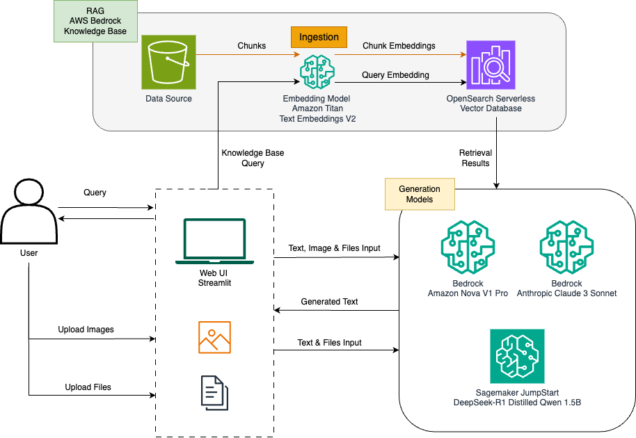
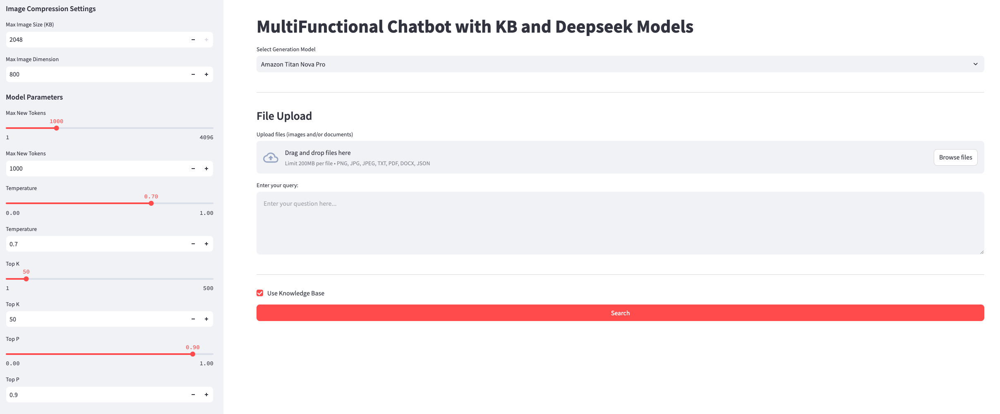

## Build Generative AI applications with Bedrock Knowledge Base and DeepSeek R1 Models

This project demonstrates how to build a multi-functional chatbot that leverages AWS Bedrock Knowledge Base and multiple AI models including DeepSeek R1, Amazon Titan Nova Pro, and Claude 3.5 Sonnet.


###  1. Architecture Overview




### 2. Application Components

**2.1 Knowledge Base System** 
- AWS Bedrock Knowledge Base for document storage and retrieval
- Amazon Titan Text Embeddings V2 for text vectorization
- OpenSearch Serverless for vector search capabilities

**2.2 Generation Models**
- Amazon Titan Nova Pro - Supports text, images, files and knowledge base integration
- Claude 3.5 Sonnet - Supports text, images, files and knowledge base integration
- DeepSeek R1 Distill Qwen 1.5B - Supports text, files and knowledge base integration

**2.3 Web Interface**
- Built with Streamlit
- Supports file uploads (images, PDFs, text files, etc)
- Interactive query interface
- Model parameter controls

### 3. Application Features:

**3.1 Multi-Modal Input Support**
- Text queries
- Image uploads with automatic compression
- Document uploads (PDF, TXT, DOCX, JSON, etc)
- Preview capabilities


**3.2 Knowledge Base Integration**
- Document ingestion and chunking
- Vector embeddings generation
- Semantic search capabilities

**3.3 Model Selection**
- Choice between different AI models
- Configurable model parameters
- Model-specific optimizations


### 4. Setup and Usage

*This Demo project is developed with AWS Sagemaker AI Studio, https://docs.aws.amazon.com/sagemaker/latest/dg/studio-updated-jl.html*

4.1. Please follow [guidence steps](https://docs.aws.amazon.com/sagemaker/latest/dg/studio-updated-jl-user-guide.html) here, if you don't use AWS Sagemaker AI Studio.

4.2. Please clone this repo or upload the code to the juoyterlab notebook, and then starting with `lab/lab-code.ipynb`.

4.3. Run the cells of the notebook, to initialize all the related resources on your AWS account.

4.4. Once the resources are initilized, then please execute the below steps to access the Streamlit Web App:

```bash
# Start a Terminal Session on Jupyterlab, then execute the below command:

pip install streamlit

streamlit run lab/app.py 

# To access the Streamlit Web Application via:
# 1. Copy & paste the URL of the Sagemaker Studio Jupyterlab web URL, eg:
https://xxxxxxxxxxxxx.studio.us-west-2.sagemaker.aws/jupyterlab/default/lab/.../lab-code.ipynb

# 2. Update the url as below format, and access the url via a new browser tab:
https://xxxxxxxxxxxxx.studio.us-west-2.sagemaker.aws/jupyterlab/default/proxy/8501/

```
4.5. Clean up via executing the last cell of the notebook.


### 5. Test the Application:

5.1. To verify if the KB is working as expected, please use any model in the APP with below query:
```
Please find the next half sentence of the below sentence:

In macroscopic closed systems, nonconservative forces act to change the internal energies of the system
```
Expected answer should contain:
```
and are often associated with the irreversible transformation of energy into heat.
```


5.2. You can disable `Use Knowledge Base` then test with general Q&A with different models.

5.3. You can upload images and/or files to test the Application.

```
Please aware
- with any attachment uploaded, then the APP will disable the KB by default.
- DeepSeek as text based model, current does not support image session.
```

5.4 Streamlit Web UI Screenshot




## License
This library is licensed under the MIT-0 License. See the LICENSE file.

## Security

See [CONTRIBUTING](https://github.com/aws-samples/generative-ai-workshop-build-a-multifunctional-chatbot-on-sagemaker/blob/main/CONTRIBUTING.md) for more information.
