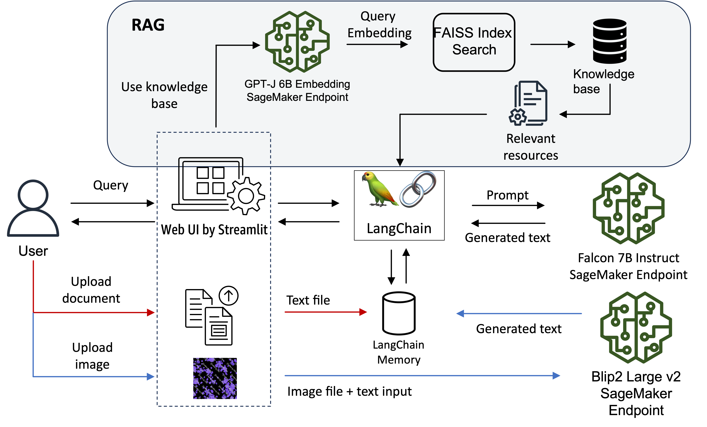

## Amazon SageMaker Generative AI workshop - Build Generative AI applications on SageMaker
This repository contains code examples for **SageMaker** Generative AI, which is designed to help users build a multi-functional chatbot on Amazon SageMaker. This repo contains two modules: Module 1, build a multi-functional chatbot on SageMaker using open-source Large Language Models (LLMs); Module 2, build [high-accuracy Generative AI application on enterprise data using Amazon Kendra, LangChain, and large language models](https://aws.amazon.com/blogs/machine-learning/quickly-build-high-accuracy-generative-ai-applications-on-enterprise-data-using-amazon-kendra-langchain-and-large-language-models/).

### Module 1 - Build a Multi-functional Chatbot on Amazon SageMaker

In this section, we will deploy three LLMs on SageMaker to serve different input data types, such as text, image, and audio. The chatbot UI design architecture is as below:

<div align="center" >
<figcaption>Solution Architecture</figcaption></img>
</div>

When the user uploads an image file with input query, the image and query text will be sent to the [`Blip2`](https://huggingface.co/Salesforce/blip2-opt-6.7b) model, which can perform:
- image captioning
- visual question answering (VQA)
- chat-like conversations by feeding the image and the previous conversation as prompt to the model

Then the LLM will be able to answer questions about this input image. You can use LLM to batch process the image dataset with predefined questions and automatically extract useful information without manual process the image data. You can also generate image captions for the image dataset to add additional context for advanced search capability. 

When the user uploads a txt file, the information will be loaded to the [LangChain memory](https://api.python.langchain.com/en/latest/memory/langchain.memory.buffer.ConversationBufferMemory.html#langchain.memory.buffer.ConversationBufferMemory) to help the chatbot to 'remember' the document and user can `chat` with the uploaded document. 

The chatbot also has the capability to retrieve information from the knowledge database to answer questions based on the relevant information. Note that the knowledge database contains the transcribed text files from the sample video file in the 'test' folder. You can use your preferred tools to extract the text from the video file. This section is to demonstrate how to leverage the digital assets of the enterprise organisation to allow users to search for contents that are not presented as documents, such as videos and audio files. Instead of searching in the metadata or going through the whole video file to locate the relevant information. Users can transcribe all the video/audio data and store them in the vector database to allow simple senmatic search and provide the summarised answers by the LLM. The retrieved source file will also be presented to the end user for reference. 

#### Lab Instructions
We first start with the notebook, `lab1-depploy_opensource_llms_on_amazon_sagemaker_FILLIN.ipynb`, which contains three sections to deploy the text-to-text, image-to-text and embedding LLMs to SageMaker. If you have time, there are two optional sections that demonstrate how to evaluate the inference cost and deploy an open-source speech-to-text model to SageMaker. Section list:
- Section 1: Deploy Text-to-Text LLM on SageMaker
- Secton 2: Deploy image-to-text LLM on SageMaker (Multimodality)
- Section 3: Deploy embedding model and implement RAG solution using LangChain on SageMaker
- Section 4: (Optional) Run SageMaker Inference Recommender job to determine the cost and performance of the LLM
- Section 5: (Optional) Deploy speech-to-text LLM on SageMaker (note that you can also use Amazon Trascribe to performe the same function)

There are 5 tasks in this notebook that you need to 'FILL IN' the missing code. However, if you want to run the notebook with the full code, you can cope the notebook `lab1-depploy_opensource_llms_on_amazon_sagemaker.ipynb` in the `solutions` folder that has all the code cells pre-filled. demonstrates how to easily create a SageMaker endpoint for the pre-trained Stable Diffusion model and generate cat images based on user prompts. Users can input fun scenarios and prompts to generate various cat images. If you are looking for other solutions using different embedding model and vector database, you can refer to the blogs [Building AI-powered search in PostgreSQL using Amazon SageMaker and pgvector](https://aws.amazon.com/blogs/database/building-ai-powered-search-in-postgresql-using-amazon-sagemaker-and-pgvector/) and [Build a powerful question answering bot with Amazon SageMaker, Amazon OpenSearch Service, Streamlit, and LangChain](https://aws.amazon.com/blogs/machine-learning/build-a-powerful-question-answering-bot-with-amazon-sagemaker-amazon-opensearch-service-streamlit-and-langchain/).

Once all the endpoints are deployed successfully, you can open a terminal in SageMaker Studio and use the below command to run the chatbot [Streamlit](https://streamlit.io/) application. Note that you need to install the required python packages that are specified in the “requirements.txt” file. You also need to update the environment variables with the endpoint names deployed in your account accordingly. When you execute the `chatbot-text-audio-image.py` file, it will automatically update the endpoint names based on the environment variables.


```python
$ pip install -r requirements.txt
$ export nlp_ep_name=<the falcon endpoint name deployed in your account>
$ export wp_ep_name=<the whisper endpoint name deployed in your account>
$ export embed_ep_name=<the embedding endpoint name deployed in your account>
$ streamlit run chatbot-text-audio-image.py --server.port 6006 --server.maxUploadSize 6
```

To access the Streamlit UI, copy your SageMaker Studio url and replace `lab?` with `proxy/[PORT NUMBER]/`. Because we specified the server port to 6006, so the url should look like:
```
https://<domain ID>.studio.<region>.sagemaker.aws/jupyter/default/proxy/6006/
```
Replace the domain ID and region with the correct value in your account to access the UI as below:

<div align="center" >
<figcaption>Chatbot UI</figcaption></img>
</div>

You can find some suggested prompt on the left-hand-side sidebar. When you upload the sample files (you can find the sample files in the `test` folder), the chatbot will automatically provide prompt suggestions based on the input data type.

Once you finished Module 1, please feel free to move on to the next Module.
